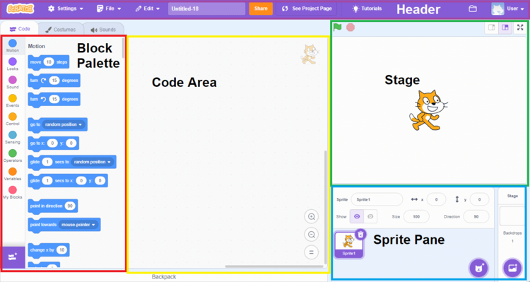
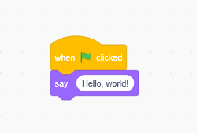
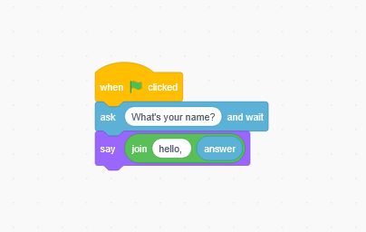
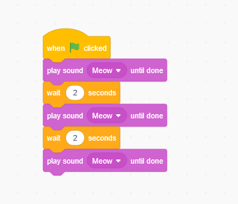
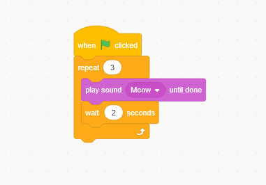
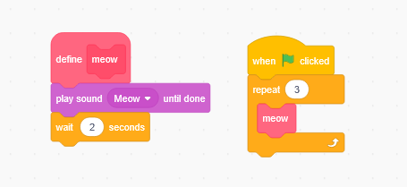
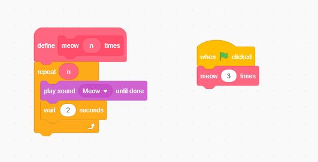
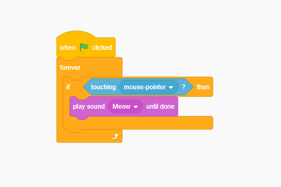

## 🧠 First Program: From Input to Output

Before learning Scratch blocks or any specific language,
it's important to understand the **core idea of programming**:

> Input → Processing → Output

This simple Python example demonstrates that idea using an AI model.

```python
from openai import OpenAI

client = OpenAI()

user_prompt = input("Prompt:")
system_prompt = "Limit your answer to one sentence."

response = client.responses.create(
	input=user_prompt,
	instructions=system_prompt,
	model="gpt-5"
)

print(response.output_text)
```
### What this program shows
- The user provides an input (a prompt)
- The program sends it to a model
- The model processes it
- The program outputs a result

Even though this example uses AI, the core logic applies to
Scratch, C, Python, and every other programming language.

## ✨ Unary

**Unary** means working with or representing **one unit at a time**. 🟢

- In programming, a **unary operation** acts on **a single value**, not two or more. 💻
- A simple real-world example is **counting with fingers**, where each count adds **one more unit** 👆🖐️

> 💡 Tip: Unary operations are like “one step at a time” — simple but powerful.

## 🔢 Binary

**Binary** is the number system computers use to represent data using only **two symbols: 0 and 1**. 💻

### 1️⃣ Why Computers Use Binary
- Computers use **electric signals**, which are either **ON (1)** or **OFF (0)**.
- Binary is **reliable** and easy for circuits to read. ⚡

### 2️⃣ Binary Digit (Bit)
- A **bit** is the **smallest unit of data** in computing.
- It can be **0 or 1**.
- Example: `1` ✅, `0` ✅

### 3️⃣ Base-2 vs Base-10
| Term      | Meaning                                         |
|-----------|------------------------------------------------|
| **Base-2** | Uses 2 digits: 0 and 1 (binary)               |
| **Base-10**| Uses 10 digits: 0–9 (decimal, humans use this)|

> 💡 Key difference: Computers think in **base-2**, humans in **base-10**.

### 4️⃣ Converting Numbers
- **Base-10 → Base-2**  
  Divide by 2 repeatedly, write remainders from bottom to top.  
  Example: `13` in decimal → binary: 
	13 ÷ 2 = 6 remainder 1 6 ÷ 2 = 3 remainder 0 3 ÷ 2 = 1 remainder 1 1 ÷ 2 = 0 remainder 1 → Binary: 1101

- **Base-2 → Base-10**  
Multiply each bit by 2^(position) and sum.  
Example: `1101` → 1×8 + 1×4 + 0×2 + 1×1 = 13 ✅

### 5️⃣ Byte
- A **byte** = **8 bits**. 🗃️
- Number of possibilities = 2^8 = **256**  
- Example: 1 byte can represent numbers 0–255.

### 6️⃣ Quick Tip
> Binary is like a **light switch system**: each bit = one switch (ON/OFF), and multiple switches together can represent many numbers or data.

## ⌨ ASCII

**ASCII** (American Standard Code for Information Interchange) is a **standard way to represent characters** using numbers. 💻

### 1️⃣ How ASCII Works
- Each character (letter, number, symbol) has a **unique number** assigned.  
- Computers store characters as **numbers in binary (base-2)**.  
- Humans usually read **decimal (base-10)** numbers, so ASCII maps numbers to characters. 🔢

Example:  
```

'A' = 65 (decimal) = 01000001 (binary)
'a' = 97 (decimal) = 01100001 (binary)

```

---

### 2️⃣ Uppercase vs Lowercase Letters
- Difference between uppercase and lowercase letters is **always 32** in decimal.  
- Why?  
```

'A' = 65
'a' = 97
Difference = 97 - 65 = 32

```
- Binary view: The **6th bit** distinguishes uppercase from lowercase. 🖥️

---

### 3️⃣ Base-2 and Base-10 in ASCII
| Character | Decimal (Base-10) | Binary (Base-2) |
|-----------|-----------------|----------------|
| A         | 65              | 01000001       |
| B         | 66              | 01000010       |
| a         | 97              | 01100001       |
| b         | 98              | 01100010       |

> Tip: Learning ASCII helps understand **how text is stored and processed** in computers.

---

### 4️⃣ Quick Note
- All **English letters, digits, and symbols** have ASCII codes.  
- ASCII is **one byte per character** (8 bits) → 256 possible values. 🗃️


## 🌐 Unicode

**Unicode** is a **universal character encoding standard** designed to represent **every written character** from all languages in the world — including emojis. 🌍

---

### 1️⃣ What is Unicode?
- Unicode assigns a **unique number (code point)** to each character.
- These characters include:
  - Latin letters (A, a)
  - Non-Latin scripts (Arabic, Chinese, Cyrillic, Devanagari, etc.)
  - Symbols (€, ©, ✓)
  - Emojis 😀🔥🚀

Example:
```
A       → U+0041
a       → U+0061
🙂       → U+1F642
```

> `U+` means **Unicode code point**, written in hexadecimal.

---

### 2️⃣ Why Unicode Instead of ASCII?
**ASCII is not enough.**

ASCII problems:
- Only supports **128 characters** (or 256 with extended ASCII)
- Mainly English letters
- No support for:
  - Other languages (Arabic, Chinese, Turkish characters like ğ, ş)
  - Emojis
  - Many modern symbols

Unicode solves this by:
- Supporting **over 1 million possible characters**
- Covering **all languages and symbols**
- Providing a **single global standard**

---

### 3️⃣ ASCII vs Unicode (Important Relation)
- ASCII is actually a **subset of Unicode** ✅
- First 128 Unicode characters are **exactly the same as ASCII**

Example:
```

'A' → ASCII 65 → Unicode U+0041

```

So:
- Old ASCII text works perfectly in Unicode systems

---

### 4️⃣ How Emojis Work 😄
- Emojis are just **Unicode characters**
- They have large code points

Example:
```

😀 → U+1F600
🔥 → U+1F525

```

Computers store these numbers in **binary**, just like letters — only with **more bits**.

---

### 5️⃣ Unicode vs Encoding (Very Important ⚠️)
Unicode defines:
- What characters exist
- Their numeric code points

Encoding defines:
- How those numbers are stored in memory

Common Unicode encodings:
- **UTF-8** (most popular, used on the web 🌐)
- UTF-16
- UTF-32

---

### 6️⃣ Why UTF-8 Is Special
- Variable length encoding
- Uses:
  - 1 byte for ASCII characters
  - More bytes for complex characters and emojis
- Backward compatible with ASCII 👍

This is why:
- Websites
- Linux
- Python
- GitHub

all use **UTF-8 by default**.

---

### 🧠 Summary
- ASCII → small, old, English-only
- Unicode → global, modern, universal
- Emojis are **just numbers**, like letters
- Unicode made global programming possible 🚀


## ⚙️ How Unicode Works

Unicode itself does **not store characters in memory**.
Instead, it defines a **mapping system**:

> Character → Code Point → Encoding → Binary

---

### 1️⃣ Step 1: Character → Code Point
Each character is assigned a **unique number**, called a **code point**.

Examples:
```

A   → U+0041
a   → U+0061
€   → U+20AC
😀   → U+1F600

```

At this stage:
- These numbers are **abstract**
- They are **not yet stored in memory**
- They exist only as **definitions**

---

### 2️⃣ Step 2: Code Point → Encoding
To store or transmit a character, the code point must be **encoded**.

Common Unicode encodings:
- UTF-8
- UTF-16
- UTF-32

Each encoding converts code points into **bytes** differently.

---

### 3️⃣ Step 3: Encoding → Bytes (Binary)
Let’s take UTF-8 as an example.

#### UTF-8 rules (simplified):
| Code Point Range | Bytes Used |
|------------------|-----------|
| U+0000 – U+007F  | 1 byte    |
| U+0080 – U+07FF  | 2 bytes   |
| U+0800 – U+FFFF  | 3 bytes   |
| U+10000+         | 4 bytes   |

Example:
```

A (U+0041) → 01000001        (1 byte)
€ (U+20AC) → 11100010 10000010 10101100  (3 bytes)
😀 (U+1F600) → 11110000 10011111 10011000 10000000 (4 bytes)

```

---

### 4️⃣ Why Unicode Needs Multiple Bytes
ASCII uses:
```

1 byte → 256 possibilities

```

Unicode needs:
- Thousands of languages
- Symbols
- Emojis

So:
- Some characters need **more than 1 byte**
- UTF-8 increases bytes **only when needed**

This keeps memory efficient 🚀

---

### 5️⃣ Why Computers Love Unicode
- One global system 🌍
- No language conflicts
- Same file works on:
  - Windows
  - Linux
  - macOS
  - Web
- Emojis, languages, symbols all handled consistently

---

### 🧠 Key Insight (Very Important)
> Unicode defines **what characters mean**  
> Encoding defines **how characters are stored**

Many beginners confuse these two.
Understanding this difference is **core computer science knowledge**.

## 🎨 Color

Computers represent colors using **numbers**.
Every color you see on a screen is just a **combination of values** stored in memory. 💡

---

### 1️⃣ How Colors Are Represented
Most digital screens use the **RGB color model**.

**RGB** stands for:
- **R**ed
- **G**reen
- **B**lue

Each color is created by mixing these three base colors. 🌈

---

### 2️⃣ RGB Values
- Each RGB component has a value between **0 and 255**
- Why 255?
  - Because one component uses **1 byte (8 bits)**
  - 8 bits → 256 possible values (0–255)

Example:
```
Red     → RGB(255, 0, 0)
Green   → RGB(0, 255, 0)
Blue    → RGB(0, 0, 255)
White   → RGB(255, 255, 255)
Black   → RGB(0, 0, 0)
```

---

### 3️⃣ How Colors Work in Binary
Each RGB value is stored in **binary**.

Example:
```
255 → 11111111
0   → 00000000
```

So:
```
Red → 11111111 00000000 00000000
```

This means:
- Red = full intensity
- Green = off
- Blue = off

---

### 4️⃣ How Many Colors Are Possible?
Each color uses:
- 3 bytes (Red, Green, Blue)
- 8 bits × 3 = **24 bits**

Total possible colors:
```
256 × 256 × 256 = 16,777,216 colors
```

This is called **24-bit color** (True Color). 🎯

---

### 5️⃣ Hexadecimal Color Representation
Colors are often written in **hexadecimal (base-16)**.

Format:
```
#RRGGBB
```

Examples:
```
Red     → #FF0000
Green   → #00FF00
Blue    → #0000FF
White   → #FFFFFF
Black   → #000000
```

Why hex?
- Shorter than binary
- Easier to read than base-10
- Maps perfectly to bytes

---

### 6️⃣ Key Idea
> Color on a computer is **just math and memory**.
> Screens turn numbers into light.

Understanding color helps with:
- Web development
- Graphics
- Game development
- Low-level system thinking 🧠

## 🎬 Video

A video is **not a moving image**.
It is a **fast sequence of images** shown one after another. 🧠

---

### 1️⃣ What Is a Video?
- A video is made of **frames**
- Each frame is a **still image**
- When frames are shown quickly, the brain sees motion

Example:
```
24 frames per second (FPS)
30 frames per second (FPS)
60 frames per second (FPS)
```

More frames per second → smoother video 🎞️

---

### 2️⃣ What Is a Frame?
- A frame is a **digital image**
- Each pixel has a **color** (RGB)
- So a frame = grid of colored pixels

Example:
```
1920 × 1080 resolution
= 2,073,600 pixels per frame
```

---

### 3️⃣ How Frames Are Stored
Each pixel:
- Uses RGB
- Typically 3 bytes (24 bits)

Uncompressed size of one frame (Full HD):
```
2,073,600 pixels × 3 bytes ≈ 6 MB
```

That is **one single frame**.

---

### 4️⃣ Why Compression Is Necessary
Raw video is **extremely large**.

Example:
```
6 MB × 30 FPS ≈ 180 MB per second
```

This is why videos use **compression** 📦

---

### 5️⃣ How Video Compression Works (Core Idea)
Video compression stores:
1. **Key frames** (full images)
2. **Differences** between frames

If only a small part changes (like a moving face):
- The computer stores only the **change**
- Not the entire image again

This saves huge amounts of space.

---

### 6️⃣ Common Video Components
A video consists of:
- **Video codec** (how frames are compressed)
- **Audio track**
- **Container** (file format)

Examples:
```
Codec: H.264, H.265, VP9, AV1
Container: MP4, MKV, AVI
```

---

### 7️⃣ How Videos Are Played
1. File is read from storage
2. Data is decoded
3. Frames are rebuilt in memory
4. Frames are displayed rapidly on the screen

All happens many times per second ⚡

---

### 🧠 Key Insight
> Video is just **images + time + clever math**.

Understanding this helps with:
- Streaming platforms
- Game engines
- Video editing
- Graphics programming

## 🔊 Audio (Sound)

Sound is **vibration**.
Computers cannot store vibrations, so they store **numbers** instead. 🔢

---

### 1️⃣ From Real Sound to Digital Sound
Real-world sound:
- Air vibrates
- Vibrations travel as **waves**

Computer representation:
- Sound waves are **measured**
- Measurements are turned into **numbers**
- Numbers are stored in memory

This process is called **sampling**.

---

### 2️⃣ Sampling Rate (How Often We Measure)
The **sampling rate** tells us:
- How many times per second the sound wave is measured

Example:
```
44,100 samples per second (44.1 kHz)
```

Why 44.1 kHz?
- Human hearing range ≈ up to 20 kHz
- Sampling must be **higher than twice** the max frequency

Higher sample rate → better sound 🎧

---

### 3️⃣ Bit Depth (How Precise Each Measurement Is)
- Each sample has a **value**
- Bit depth defines how detailed that value is

Examples:
```
8-bit   → 256 possible values
16-bit  → 65,536 possible values
24-bit  → 16+ million values
```

Higher bit depth → more accurate sound, less noise

---

### 4️⃣ Mono vs Stereo
- **Mono** → one audio channel
- **Stereo** → two channels (left & right)

Stereo sound stores **two sets of samples**, doubling data size.

---

### 5️⃣ How Audio Is Stored
Digital audio is stored as a **sequence of samples**.

Each sample:
- Is a number
- Stored in binary
- Replayed quickly to recreate the wave

This creates the illusion of continuous sound 🎵

---

### 6️⃣ Why Audio Needs Compression
Raw audio files are large.

Example (CD quality):
```
44,100 samples/sec
× 16 bits
× 2 channels
≈ 1.4 Mbps
```

To save space, audio is compressed.

---

### 7️⃣ Common Audio Formats
- **WAV** → uncompressed
- **MP3** → lossy compression
- **AAC** → improved lossy compression
- **FLAC** → lossless compression

Lossy compression removes sounds humans barely notice.

---

### 🧠 Key Insight
> Audio is just **numbers changing over time**.

Understanding this explains:
- Music files
- Voice calls
- Streaming audio
- Game sound engines
## 🧩 Algorithms

**Algorithm** is a **step-by-step procedure** to solve a problem.  
Think of it as a **recipe** for the computer. 🍳

---

### 1️⃣ What is an Algorithm?
- A set of **instructions** to achieve a specific goal
- Can be applied to **any type of data**: text, images, audio, video
- Goal: **efficient and correct results**

Example: How to make tea
1. Boil water
2. Put tea in cup
3. Pour water
4. Wait 3 minutes
5. Remove tea leaves

> Each step is clear and unambiguous ✅

---

### 2️⃣ Why Algorithms Matter
- Processing raw data → meaningful output
- Good algorithms:
  - Solve the problem correctly
  - Do it efficiently (less time, less memory)
- Bad algorithms:
  - Take too long
  - Use too much memory
  - Produce wrong results ❌

---

### 3️⃣ Quality of a Program
A **quality program** has:
1. **Correctness**: produces correct output for all inputs ✅
2. **Efficiency**: runs fast and uses memory wisely ⚡
3. **Readability**: humans can understand the steps 📝
4. **Scalability**: works well as problem size grows 📈

---

### 4️⃣ Real-World Example: Phone Number Directory
Problem: Find John’s phone number in a directory with 1,000 names.

**Step 1 – Naive Algorithm (Linear Search)**
1. Start at the top
2. Check each name one by one
3. Stop when you find John

- Steps: up to 1,000 comparisons
- Works ✅, but slow if directory grows

**Step 2 – Better Algorithm (Binary Search)**
- Directory is sorted alphabetically
1. Look at middle name
2. If John < middle → search left half
3. If John > middle → search right half
4. Repeat until found

- Steps: log2(1,000) ≈ 10 comparisons
- Much faster for large directories ⚡

---

### 5️⃣ Algorithm Process (Time vs Problem Size)
- **X-axis:** Problem size (n)  
- **Y-axis:** Time or steps needed
- Common patterns:
  - **Linear (O(n))** → steps grow proportionally
  - **Logarithmic (O(log n))** → steps grow slowly
  - **Quadratic (O(n²))** → steps grow very fast for large n

```

Problem Size → 10 → 100 → 1000
Linear      → 10  → 100 → 1000
Logarithmic → 3   → 7   → 10
Quadratic   → 100 → 10,000 → 1,000,000

```

> Tip: Choosing the right algorithm is often more important than programming skill.

---

### 🧠 Key Insight
> Algorithms are the **brain** of processing.  
> If input is data (text, image, video, audio), the algorithm decides **how efficiently and correctly** the output is produced.  

---

### 6️⃣ Summary
- Algorithm = step-by-step recipe
- Quality program = correct + efficient + readable + scalable
- Real-world example: Phone directory search
- Time complexity helps **predict performance** before running the program


## 💻 Coding Basics

**Coding** is the process of **writing instructions** for a computer to execute.  
It is how we **implement an algorithm** in a form the computer understands. 📝

---
### 1️⃣ Key Concepts

- **Code**: A set of instructions a computer can follow.  
- **Pseudocode**: Human-readable description of an algorithm. Not run by the computer, but helps plan the code.  
- **Function**: A reusable block of instructions that performs a specific task.  
- **Conditional (If / Else If / Else)**: Lets the computer **make decisions** based on True/False conditions.  
- **Loop**: Repeats a set of instructions until a condition is met.  
- **Boolean Expression**: A statement that is either **True** or **False**, used in conditionals and loops.  

---

### 2️⃣ Pseudocode Example

Here is a simple example using a **phone book search**:

```
Pick up phone book
Open to middle of phone book
Look at page
If person is on page
Call person
Else if person is earlier in book
Open to middle of left half of book
Go back to line 3
Else if person is later in book
Open to middle of right half of book
Go back to line 3
```

---

### 3️⃣ Explaining the Pseudocode

1. **Functions** 🔧  
   - `Pick up`, `Open`, `Look`, `Call person`  
   - Each step does a **specific task**  
   - Functions can be reused anywhere

2. **Boolean Expression** ✅  
   - `person is on page`  
   - Evaluates to **True or False**  
   - Determines which path the program takes

3. **Conditionals** 🛤️  
   - `If / Else If / Else` decides **what to do next**  
   - Checks conditions in order until one is True

4. **Loops** 🔁  
   - `Go back to line 3` repeats the **Look and check process**  
   - Continues until the person is found

---

### 4️⃣ How It Works Together

- Computer starts with the **first function**  
- Checks the **boolean condition**  
- Chooses the correct **conditional branch**  
- Repeats using the **loop** if necessary  
- Ends when the goal is reached ✅

> Tip: All programs are just combinations of **functions + conditionals + loops + boolean expressions**.  
> Mastering these basics lets you implement any algorithm.

Harika, Lecture 0 seviyesinde **Compiler** kavramını sade ve rehber tarzında açıklayalım. 🔹

---


## 🏗️ Compiler 

A **compiler** is a program that **translates code written by humans into machine code** (0s and 1s) so the computer can understand it. 💻

---

### 1️⃣ Why Do We Need a Compiler?
- Computers only understand **binary (0 and 1)**  
- Humans write code in **high-level languages** (Python, C, Java)  
- The compiler **bridges the gap** between human language and machine language

---

### 2️⃣ How It Works Step by Step
1. **Source code** → the code you write in a programming language  
2. **Lexical analysis** → breaks code into meaningful pieces (tokens)  
3. **Syntax analysis** → checks rules of the language (grammar)  
4. **Semantic analysis** → checks meaning (does this make sense?)  
5. **Optimization** → makes code run faster / use less memory  
6. **Code generation** → outputs **machine code (0s and 1s)**

> Example:  
```c
int x = 5;
````

* Compiler converts this line into a series of 0s and 1s the CPU can execute

---

### 3️⃣ Key Insight

> The compiler is like a **translator and teacher combined**:
> It turns your human-readable code into something the computer can follow **step by step**.

* Without compilers, **programming would be extremely difficult**
* It lets us **write in readable languages** and still run programs efficiently

## 🐱 Scratch



---

### 👋 Hello World

Our **first program** in Scratch is simple but important.



* **Say("Hello World")**

  * The **Say** block is like a **function**
  * `"Hello World"` is the **argument** of the function

We can visualize this in **Input → Algorithm → Output** form:

```
Input: "Hello World" (user wants to display)
Algorithm: Say block
Output: "Hello World" bubble
```



Now, let’s make it interactive:

* **Ask and Wait** block prompts the user for input (like your name)
* The **answer** variable stores this input
* **Say(answer)** can now display the input
* To make it more personal, use **Join** to combine text:

```
Join("Hello, ", answer) → Say("Hello, David")
```

> 💡 **Return Values**: Input returns information to the program, which we can use elsewhere.
> Example: User inputs their name → stored in `answer` → displayed using `Say` block.

**Input → Algorithm → Output** example:

| Input               | Algorithm             | Output         |
| ------------------- | --------------------- | -------------- |
| "What's your name?" | Ask and Wait → answer | "David"        |
| "hello, answer"     | Join → Say            | "Hello, David" |

---

### 🐾 Meowing Cat Example

We want the cat to **meow 3 times**.



* This works, but it’s **repetitive**
* Writing `Meow()` + `Wait 2 seconds` **3 times manually** is not efficient

Instead, we use the **Repeat** block:



* Cleaner code, same effect ✅

---

### 🛠️ Creating Functions (Custom Blocks)

Every time we want the cat to meow, writing long sequences is cumbersome.
We can define a **custom block** (function):



* **Define Meow** block contains the instructions for meowing
* Then, in the main program, we just call `Meow()`



* We can even add **inputs to our custom block**
* Example: `Meow n times` → takes `n` as input
* Inside the definition, a **Repeat block** uses the `n` variable
* Now, we just call `Meow(3)` in the main program

> ✅ Custom blocks = reusable functions = cleaner code

---

### ⚡ Conditionals and Boolean Expressions



* Place an **If block** inside a **Forever loop**
* The If block requires a **Boolean expression** (a True/False condition)
* Example: `If mouse is touching cat → Meow`

```
Forever
    If <mouse touching cat?>
        Meow
```

* **Forever loop** ensures the condition is **checked continuously**
* Without Forever, the program would run once and stop immediately
* This way, the cat reacts **whenever** the mouse touches it

---

### 🧠 Key Concepts Learned in Scratch

1. **Functions / Custom Blocks**

   * Reusable actions, like `Meow()` or `Say()`
2. **Variables**

   * Store values that can change (like `answer` or `n`)
3. **Loops**

   * Repeat actions: `Repeat`, `Forever`, `Repeat Until`
4. **Conditionals**

   * Make decisions: `If`, `If-Else`
5. **Input / Output**

   * `Ask and Wait` → input
   * `Say` → output
6. **Combining Concepts**

   * Custom blocks + loops + conditionals + variables → interactive programs

> Scratch is a **visual way to understand programming logic** before moving to text-based languages like Python, C, or JavaScript.
---