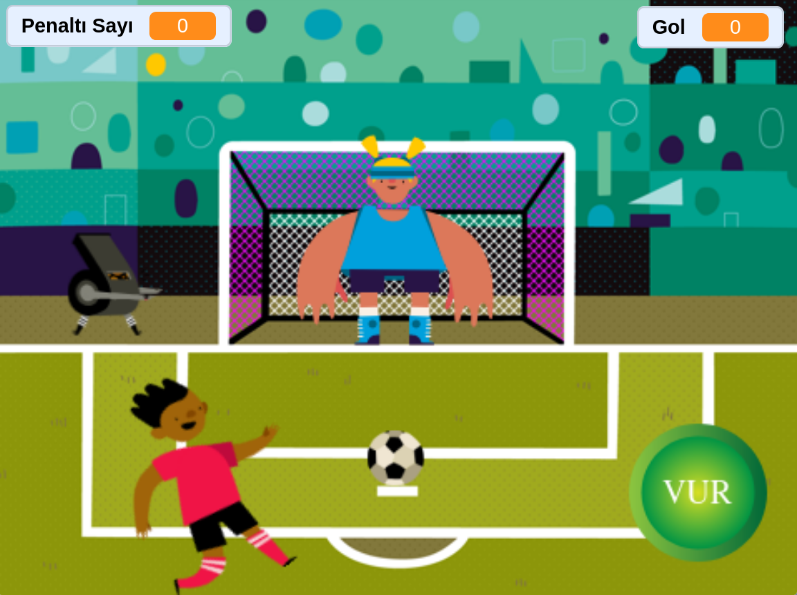

# ⚽ Penalty Shootout Game (CS50x Pset 0)

An interactive penalty shootout simulation developed using Scratch 3.0. This project serves as my submission for **Problem Set 0** of Harvard University's **CS50x: Introduction to Computer Science**.

## 📖 Description

**Penalty Game** challenges the player to score goals against an AI-controlled goalkeeper. The game utilizes physics-based movement simulations, randomization for the goalkeeper's difficulty, and variable tracking for scores to create an engaging arcade experience.

The project demonstrates core programming concepts such as loops, conditionals, event handling, and state management within the Scratch environment.

## 🎮 How to Play

1.  **Start the Game:** Click the Green Flag 🏳️ to initialize the match.
2.  **Aim & Shoot:** * Wait for the moving arrow/target to align with your desired corner.
    * Press **[MOUSE CLICK]** to shoot the ball.
3.  **Scoring:** * If the ball passes the goalkeeper and hits the net, your **Score** increases by 1.
    * If the goalkeeper blocks it or you miss, the **Miss** counter increases (or game over).
4.  **Win Condition:** Reach a score of **[5]** to win the trophy!

## 🛠️ Technical Implementation (CS50 Requirements)

This project meets and exceeds the requirements for CS50x Problem Set 0 by implementing the following:

* **Sprites:** Multiple interactive sprites including the Player, Goalkeeper, Soccer Ball, and Goal Post.
* **Scripts:** Each sprite contains distinct scripts handling animation, collision detection, and game logic.
* **Conditionals (`if`, `else`):** Used to determine if a goal is scored (`touching color` or `touching sprite`) or if the keeper saved it.
* **Loops (`forever`, `repeat`):** Used for the continuous movement of the goalkeeper and the ball's trajectory animation.
* **Variables:** * `Score`: Tracks the player's successful goals.
    * `Attempts`: (Optional) Tracks total shots taken.
* **Sound:** Integrated audio effects for kicking, crowd cheering upon scoring, and referee whistles.

## 📂 Installation & Usage

Since this is a Scratch project (`.sb3`), you can run it in two ways:

### Option 1: Scratch Website (Recommended)
You can view and play the project directly on the Scratch community website:
[**🔗Project Link**](https://scratch.mit.edu/projects/1276441823)

### Option 2: Offline Editor
1.  Download `Penalty Game.sb3` File.
2.  Go to the [Scratch Website](https://scratch.mit.edu/projects/editor/).
3.  Select **File > Load from your computer**.
4.  Choose the `Penalty Game.sb3` file from this repository.

## 📸 Screenshots / Demo

## 🤝 Credits

* **Developer:** Subhan Mammadli
* **Course:** [CS50x: Introduction to Computer Science](https://cs50.harvard.edu/x/)
* **Assets:** Standard Scratch library assets and custom vector modifications.

---
*Thanks for checking out my first CS50 project!*